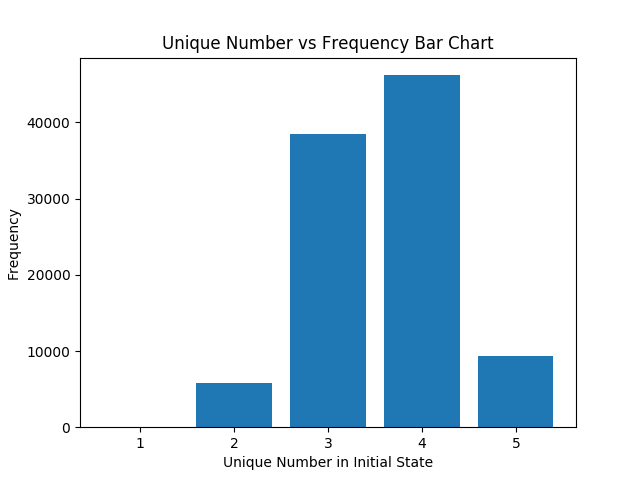
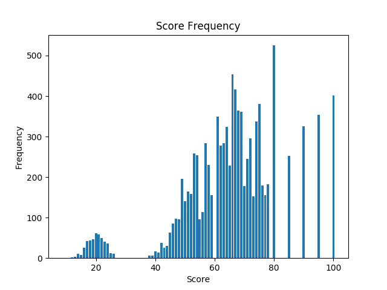
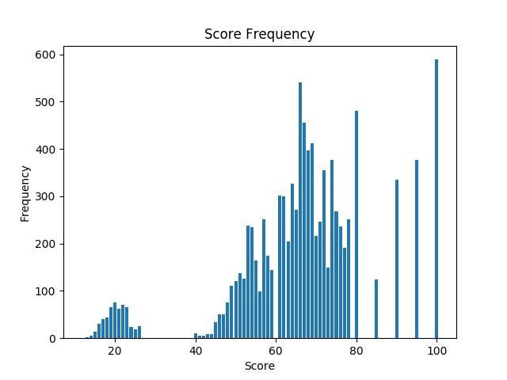

# Dice Game

## AI Assignment 2

by 
**Lew Jiayi**

---

## Rules of Game

- In every game, the player has 5 dice.
- The player is allowed 5 rerolls.
- For each reroll, the player can decide which dice to be kept and choose any number of dice to reroll.
- The game ends after 5 rerolls or when the player - decides not to reroll.
- After the game ends, points are calculated based on the output combination of the dice.
- Every player will play 5 games.

### Points

| Dice combinations | Points |
| - | - |
| Five-in-a-row | Sum of dice + 70 |
| Straight (1-2-3-4-5, 2-3-4-5-6) | Sum of dice + 60 |
| Full house (Three + Two of a kind) | Sum of dice + 50 |
| Four-of-a-kind (Four + One) | Sum of dice + 40 |
| Three-of-a-kind (Three + One + One) | Sum of dice + 30 |
| Other combinations | Sum of dice |

---

## Break Down of rules

<p style="text-align: justify">
The end goal of this game is to achieve score as high as possible for all 5 rounds. To achieve higher score, the aim is to go for a good dice combination. An easier way to look at the dice combination is by looking at unique numbers in the set of dice.
</p>
<br>

#### One unique number

One unique number simply means all the dice faces are the same and it will definitely be **five-in-a-row**

| A | A | A | A | A |
| - | - | - | - | - |
<br>

#### Two unique numbers

Two unique numbers can have two different combinations which are:

**Four of a kind**

| A | A | A | A | B |
| - | - | - | - | - |

**Full House**

| A | A | A | B | B |
| - | - | - | - | - |
<br>

#### Three unique numbers

Three unique numbers can have two different combinations which are:

**Three of a kind**

| A | A | A | B | C |
| - | - | - | - | - |

**Other Combination**

| A | A | B | B | C |
| - | - | - | - | - |
<br>

#### Four unique numbers

Four unique numbers can only have one outcome which is:

| A | A | B | C | D |
| - | - | - | - | - |
<br>

#### Five unique numbers

| A | B | C | D | E |
| - | - | - | - | - |

Although this is the only combination representation but it has two different outcome, either a straight or nothing. An easy to check if this is a straight is to check if both 1 and 6 exist in the combination. If so, it is not a straight.
<br><br>

### Code

The code of checking combination is as below.

We start by sum up all the faces of the dice. Then we make the list of dice into a set to remove duplicate faces.

``` py
def checkScore(self, dice_face):
        score = sum(dice_face)
        setOfDice = set(dice_face)
```

<br>
By checking the length of the set we can get the amount of unique number. If the unique number is only one, it has to be five-in-a-row

```py
        if len(setOfDice) == 1:
            return (score + 70)
```

<br>
If the length of the set is two, we convert the set to list and take both the number to count at the number of duplicates in the original list. If either of the number count is 4, we return as four of a kind. If either the of the number count is 3, we return as Full House.

``` py
        elif len(setOfDice) == 2:
            if dice_face.count(list(setOfDice)[0]) == 4 \
            or dice_face.count(list(setOfDice)[1]) == 4:
                return (score + 40)
            elif dice_face.count(list(setOfDice)[0]) == 3 \
            or dice_face.count(list(setOfDice)[1]) == 3:
                return (score + 50)
```

<br>
When the length of the set is three and if the count of any number if 2, we return as other combination. Whilst the count of any number is 3, we return as three of a kind.

```py
        elif len(setOfDice) == 3:
            if dice_face.count(list(setOfDice)[0]) == 2 \
            or dice_face.count(list(setOfDice)[1]) == 2 \
            or dice_face.count(list(setOfDice)[2]) == 2 :
                return score
            elif dice_face.count(list(setOfDice)[0]) == 3 \
            or dice_face.count(list(setOfDice)[1]) == 3 \
            or dice_face.count(list(setOfDice)[2]) == 3 :
                return (score + 30)
```

<br>
At the length of five, we check if both one and six exist in the set. If only either one exist, we return as straight.

The last line of the code `return score` will be triggerred if the set of dice does not meet all the condition stated above. The situation includes the length of set at 4 which does not have any extra score given.

```py
        elif len(setOfDice) == 5:
            one = False
            six = False
            for num, x in enumerate(dice_face):
                if x == 1:
                    one = True
                if x == 6:
                    six = True
            if not one and six:
                return (score + 60)
            if one and not six:
                return (score + 60)
        return score
```

---

## Strategies

<br>

### Understand the game

The first step do crack this game is to understand the game better. Below is the bar chart of the unique number in the initial state of the game vs the frequency


<p style="text-align: center"> Figure 1 </p>


From the chart we know that the highest frequency is 4 unique number followed by 3. Both these covers more than 80% of the initital state dice set.
<br><br>

### Algorithm

Since the scoring system can be based on unique numbers in the dice set, we can tackle the problem using the same logic.

Similarly, we make the list of dice into a set to remove duplicate faces.

```py
def play(self, dice_face, available_rerolls):
    setOfDice = set(dice_face)
```

<br>

#### One unique number

For situation of one unique number in the dice set, we does not have to do anything as it has get the one of the highest score.

```py
    if len(setOfDice) == 1:
        return []
```

<br>

#### Two unique number
As for two unique number, we check if it is four of a kind or full house.

In the case of four of a kind, we loop through the list of dice and look for the single number and reroll it

```py
    elif len(setOfDice) == 2:
        if dice_face.count(list(setOfDice)[0]) == len(dice_face) - 1 \
        or dice_face.count(list(setOfDice)[1]) == len(dice_face) - 1:
            for num, x in enumerate(dice_face):
                if dice_face.count(x) == 1:
                    return [num]
```

<br>
As for full house, we don't reroll anything. Althought five in a row or straight is an improvment from the current score but the risk is high.
<br>
<br>

<p style="text-decoration: underline">
Improve to five in a row </p>

| A | A | A | B | B | &#8680; | A | A | A | A | A |
| - | - | - | - | - |    -    | - | - | - | - | - |

or

| A | A | A | B | B | &#8680; | B | B | B | B | B |
| - | - | - | - | - |    -    | - | - | - | - | - |

To improve to five in a row, we need to reroll two or three dices. The chances of improvement is *2.78%* and *0.46%* respectively. The chances of retaining a full house will be *13.89%* and *2.31%* respectively. This simply is not a wise move.

<p style="text-decoration: underline">
Improve to straight </p>

| A | A | A | B | B | &#8680; | A | B | C | D | E |
| - | - | - | - | - |    -    | - | - | - | - | - |

To improve to straight, we need to reroll up to three dice. The chance of improvment is *0.46%* and retaining full house is *2.31%*. Similarly, this is not a wise move

Hence, the move here is to do nothing, `return []`.

```py
        elif dice_face.count(list(setOfDice)[0]) == len(dice_face) - 2 \
        or dice_face.count(list(setOfDice)[1]) == len(dice_face) - 2:
            return []
```

<br>

#### Three unique number

Here there are only two possibility, three of a kind or two-two-one combination.
<br>

##### Three of a kind

In case of three of a kind, the improvements are:

- Five in a row
- Full House
- Four of a kind
- Straight

The improvement can be divided into two categories, keeping the duplicates or reroll the duplicates dices. Any other move will have a high risk. For example:
| A | A | A | B | C | &#8680; | B | B | B | B | B |
| - | - | - | - | - |    -    | - | - | - | - | - |
Rerolling four dices will only *0.077%* chances of getting five in row and *1.54%* to retaing three of a kind.
<br>

<p style="text-decoration: underline">
Keeping Duplicates</p>

Keeping duplicates will result in the following outcomes:

1. Five in a row

| A | A | A | B | C | &#8680; | A | A | A | A | A |
| - | - | - | - | - |    -    | - | - | - | - | - |

2. Full House

| A | A | A | B | C | &#8680; | A | A | A | B | B |
| - | - | - | - | - |    -    | - | - | - | - | - |

3. Four of a kind

| A | A | A | B | C | &#8680; | A | A | A | A | B |
| - | - | - | - | - |    -    | - | - | - | - | - |

4. Three of a kind

| A | A | A | B | C | &#8680; | A | A | A | B | C |
| - | - | - | - | - |    -    | - | - | - | - | - |

The probability to getting the outcomes above are *2.78%*, *13.89%, *27.78% and *55.56%* respectively

<br>

<p style="text-decoration: underline">
Remove Duplicates</p>

Removing duplicates will result in the following outcomes:

1. Straight

| A | A | A | B | C | &#8680; | A | B | C | D | E |
| - | - | - | - | - |    -    | - | - | - | - | - |

2. Four of a kind

| A | A | A | B | C | &#8680; | A | A | A | A | B |
| - | - | - | - | - |    -    | - | - | - | - | - |

3. Full House

| A | A | A | B | C | &#8680; | A | A | A | B | B |
| - | - | - | - | - |    -    | - | - | - | - | - |

4. Three of a kind

| A | A | A | B | C | &#8680; | A | A | A | B | C |
| - | - | - | - | - |    -    | - | - | - | - | - |

5. Other Combination

| A | A | A | B | C | &#8680; | A | B | C | D | E |
| - | - | - | - | - |    -    | - | - | - | - | - |

| A | A | A | B | C | &#8680; | A | A | B | B | C |
| - | - | - | - | - |    -    | - | - | - | - | - |

| A | A | A | B | C | &#8680; | A | A | B | C | D |
| - | - | - | - | - |    -    | - | - | - | - | - |

The probability of getting the outcomes above are *2.78%*, *0.46%*, *1.39%*, *5.56%* and *89.81%*. 

There is about 90% of the time we will get nothing from rerolling the duplicates. It is obviously not a good move here. Hence, we will go for keeping the tactic of keeping the duplicates. However, here, we have another extended tactic which is reroll the single smallest dice to go for full house. The results are:

1. Full House

| A | A | A | B | C | &#8680; | A | A | A | B | B |
| - | - | - | - | - |    -    | - | - | - | - | - |

2. Three of a kind

| A | A | A | B | C | &#8680; | A | A | A | B | C |
| - | - | - | - | - |    -    | - | - | - | - | - |

Where the chances are *16.67%* and *83.33%* respectively. *83.33%* of retaining the same score compared to *55.56%* from rerolling both non-duplicate dices is a worse move. Therefore, the algorithm is as below

```py
    elif len(setOfDice) == 3:
        r = []
        for num, x in enumerate(dice_face):
            if dice_face.count(x) == 1:
                r.append(num)
        return r
```

<br>
##### Two-Two-One

In case of two-two-one, the improvements are:

- Five in a row
- Full House
- Four of a kind
- Three of a kind
- Straight

There are three strategies we can choose from in this case, removing duplicates, keeping all duplicates or keeping one set of duplicates only. Similarly to cases above, removing the duplicates will leave us on high odds of getting nothing. So we will be looking into either keeping all or one set of duplicates.

<br>
<p style="text-decoration: underline">
Keeping All Duplicates</p>

Keeping duplicates will results in following outcomes:

1. Full House

| A | A | B | B | C | &#8680; | A | A | A | B | B |
| - | - | - | - | - |    -    | - | - | - | - | - |

2. Other combination

| A | A | B | B | C | &#8680; | A | A | B | B | C |
| - | - | - | - | - |    -    | - | - | - | - | - |

The probability of getting Full House is *16.67%* and nothing is *83.33%*. 

<br>
<p style="text-decoration: underline">
Keeping One Duplicate</p>

Keeping duplicates will results in following outcomes:

1. Five in a row

| A | A | B | B | C | &#8680; | A | A | A | A | A |
| - | - | - | - | - |    -    | - | - | - | - | - |

2. Full House

| A | A | B | B | C | &#8680; | A | A | A | B | B |
| - | - | - | - | - |    -    | - | - | - | - | - |

3. Four of a kind

| A | A | B | B | C | &#8680; | A | A | A | A | B |
| - | - | - | - | - |    -    | - | - | - | - | - |

4. Three of a kind

| A | A | B | B | C | &#8680; | A | A | A | B | C |
| - | - | - | - | - |    -    | - | - | - | - | - |

5. Other combination

| A | A | B | B | C | &#8680; | A | A | B | B | C |
| - | - | - | - | - |    -    | - | - | - | - | - |

| A | A | B | C | D | &#8680; | A | A | B | C | D |
| - | - | - | - | - |    -    | - | - | - | - | - |

The probability of getting the outcomes above are *0.46%*, *9.26%*, *6.94%*, *27.78%* and *55.56%* respectively.

Although the second approch has a lower chance of getting no points, but the probability of getting a good score is low as well. To better choose betweene these two approch, we can calculate the sum of odds times score.

> 1. Keeping all duplicates:
> 
> (*16.67%* * 50 points) + (*83.33%* * 0 point) 
> = **8.335** points
>
> 2. Keeping one duplicates:
>
> (*0.46%* * 70 points) + (*9.26%* * 50 points) + (*6.94%* * 40 points) + (*27.78%* * 30 points) + (*55.56%* * 0 point)
> = **16.062** points

<br>

From the calculaton above we know that keeping only one duplicates is likely to yield a higher score. Therefore the algorithm will keep the higher duplicates and reroll the other three dices. The complete algorithm for three unique number of the dice set is as below.

```py
    elif len(setOfDice) == 3:
        r = []
        h = 0
        for num, x in enumerate(dice_face):
            if dice_face.count(x) == 1:
                r.append(num)
            if x > h:
                if dice_face.count(x) == 2:
                    h = x
        if dice_face.count(list(setOfDice)[0]) == 2 \
        or dice_face.count(list(setOfDice)[1]) == 2 \
        or dice_face.count(list(setOfDice)[2]) == 2 :
            r.clear()
            for num, x in enumerate(dice_face):
                if x < h:
                    r.append(num)
        return r
```
<br>
#### Four unique number

Four unique numbers will only have one combination, one duplicate set one three other number. Similary to three unique number, the approch here is either keep or remove the duplicates.

<br>
<p style="text-decoration: underline">
Keeping Duplicate</p>

The outcomes of keeping duplicates are the exact same outcome as keeping one duplicates in Two-Two-One situation.

> **Keeping one duplicates**
>
> (*0.46%* * 70 points) + (*9.26%* * 50 points) + (*6.94%* * 40 points) + (*27.78%* * 30 points) + (*55.56%* * 0 point)
> = **16.062** points


<br>
<p style="text-decoration: underline">
Remove Duplicate</p>

One duplicate in the dice set does not always mean we are only one number away from straight. For example at cases where both one and six exist in the dice set we have to reroll either one or six. We will first look at cases where either only one or six exist

The outcomes of removing duplicates are:

1. Straight

| A | A | B | C | D | &#8680; | A | B | C | D | E |
| - | - | - | - | - |    -    | - | - | - | - | - |

2. Other combination

| A | A | B | C | D | &#8680; | A | B | C | D | F |
| - | - | - | - | - |    -    | - | - | - | - | - |

| A | A | B | C | D | &#8680; | A | A | B | C | D |
| - | - | - | - | - |    -    | - | - | - | - | - |

The probability of the outcomes are *16.67%* and *83.33%* respectively.

> **Remove duplicates**:
> 
> (*16.67%* * 60 points) + (*83.33%* * 0 point) 
> = **10** points

<br>
Looking at the calculation, keeping duplicates will be a better move, hence, we can skip on case where both one and six occurs for removing duplicate. The algorithm will remove all dices that are not duplicate.

```py
        elif len(setOfDice) == 4:
            r =[]
            for num, x in enumerate(dice_face):
                if dice_face.count(x) == 1:
                    r.append(num)
            return r
```

<br>
#### Five unique number

The logic is pretty simple at five unique number. If both one and six exist, reroll the dice 1 and go for a straight. Otherwise, simply keep the straight!

```py
    elif len(setOfDice) == 5:
        one = False
        six = False
        for num, x in enumerate(dice_face):
            if x == 1:
                one = True
                r = num
            if x == 6:
                six = True
        if one and six:
            return [r]
        return []
```

---

## Outcome

Using the algorithm above, we ran the game 100000 times and plotted a graph of the score and the frequency respectively along with the average score and the low score percentage percentage. Low score is defined as the final score of the game is lower than 38. The number of 38 comes from the lowest score we can get from the any combination which is the combination:
| 1 | 1 | 1 | 2 | 3 |
| - | - | - | - | - |
Any other score lower than 38 is the result of failure to get any combination.

The outcome of the game is as below.

Average score: 66.32
Low Score Percentage: 4.5%

---

### Improvement

After coming out with the basic strategies and  structure of the algorithm, we can take into consideration of the faces of the dices and available rerolls for improvement.

The score of a game partially depends on the sum of dice. Based on the strategy, most of the game start with four unique numbers, so we start from here. The logic is to reroll the duplicate if the duplicate is 3 or lower as these situtation usually result in lower score.

#### Four Unique Number Low Score Alternative

```py
elif len(setOfDice) == 4:
    r =[]
    h = 0
    for num, x in enumerate(dice_face):
        if dice_face.count(x) == 1:
            r.append(num)
            if x > h:
                h = x
                hnum = num
        else:
            duplicate = x
    if duplicate <= 3:
        r = [0,1,2,3,4]
        r.remove(hnum)
        return r
    return r
```

The results of this improvement is as below.


Average score: 67.36
Low Score Percentage: 5.45%

To make the algorithm more stable, available reroll was taken into consideration for the reroll of low score dice.

```py
if available_rerolls >= 4:
    if duplicate <= 3:
        r = [0,1,2,3,4]
        r.remove(hnum)
        return r
```

The result of adding this algorithm does not provide any significant changes.

<br>

#### Three Unique Number Low Score Alternative

The same logic was applied to three unique number. However, The result was negative for rerolling duplicate dice that are larger than 1. Rerolling duplicate 1 although provide a 0.05 improvement in average score but the low score percentage increased by 0.5%. The slight improvement of score does not worth the risk consider the game is only 5 rounds instead of 10000 in testing.


